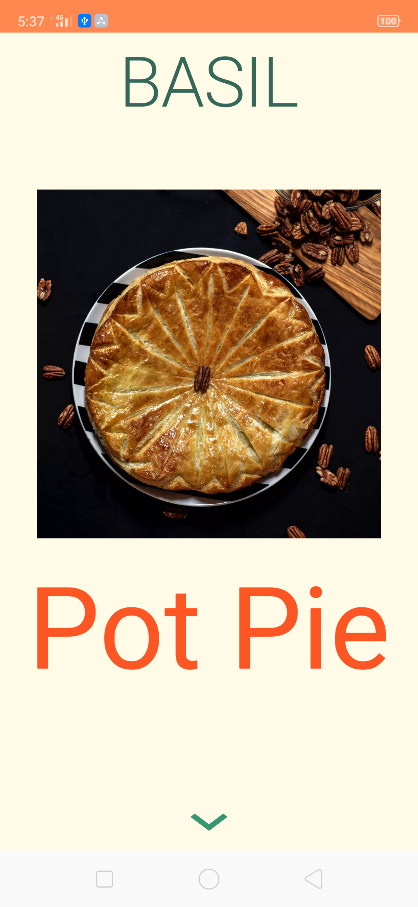

# Basil
ViewPager2 with parallax transformation 

Introduction
------------
application to create ViewPager2 with RescyclerView.Adapter with Parallax transformation like Basil home screen.

*[design of Basil](https://material.io/design/material-studies/basil.html#about-basil)

*images used from [unsplash](https://unsplash.com)

Demo
------------
[gif](screenshots/homeDemo.gif)

Screenshots
-----------

## Libraries Used

This module requires the following modules/libraries:

* [ViewPager2](https://developer.android.com/jetpack/androidx/releases/viewpager2)
* [Kotlin](https://kotlinlang.org)
* [Androidx](https://developer.android.com/jetpack/androidx)
* [Android ViewModel](https://developer.android.com/topic/libraries/architecture/viewmodel)
* [Android LiveData](https://developer.android.com/topic/libraries/architecture/livedata)
* [MVVM architecture](https://developer.android.com/jetpack/docs/guide)
* [Glide]()

## Installation

Install as usual,
* Clone this repo.
* Update your android studio to verion 3.4 .
* Happy coding.

